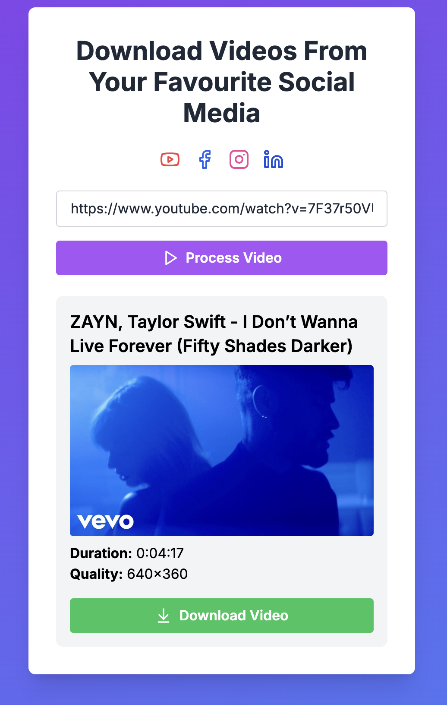

# Youtube Facebook Downloader

Welcome to the Youtube Facebook Downloader project! This project allows you to download videos from YouTube and Facebook using a simple web interface. The backend is built with Flask, and the frontend is built with Next.js 13.

## Introduction

The Youtube Facebook Downloader project is designed to provide an easy-to-use interface for downloading videos from YouTube and Facebook. The backend handles the video extraction and downloading, while the frontend provides a user-friendly interface for interacting with the backend.

## Setting Up the Backend

To set up the backend, follow these steps:

1. **Clone the repository:**
   ```bash
   git clone https://github.com/leviethung2103/youtube-facebook-downloader
   cd youtube-facebook-downloader/backend
   ```

2. **Create a virtual environment:**
   ```bash
   python3 -m venv venv
   source venv/bin/activate
   ```

3. **Install the required dependencies:**
   ```bash
   pip install -r requirements.txt
   ```

4. **Run the Flask server in the background using `screen`:**
   ```bash
   screen -S flask_app
   cd youtube-facebook-downloader/backend
   source venv/bin/activate
   python app.py # or
   gunicorn --bind 0.0.0.0:3001 app:app
   ```

   To detach from the screen session, press `Ctrl + A`, then `D`.

   To reattach to the screen session later, use the following command:
   ```bash
   screen -r flask_app
   ```

The backend server should now be running on `http://localhost:3001`.

## Setting Up the Frontend

To set up the frontend, follow these steps:

1. **Navigate to the frontend directory:**
   ```bash
   cd youtube-facebook-downloader/frontend
   ```

2. **Install the required dependencies:**
   ```bash
   npm install
   ```

3. **Create a `.env` file in the root of your `frontend` directory and add the following:**
   ```env
   NEXT_PUBLIC_BACKEND_URL=http://localhost:3001
   ```

4. **Run the development server:**
   ```bash
   npm run dev
   ```

The frontend should now be running on `http://localhost:3000`.

## Deployment

### Deploying the Flask Backend

To deploy the Flask backend using `screen`, follow these steps:

1. **Start a new screen session:**
   ```bash
   screen -S flask_app
   ```

2. **Navigate to the backend directory and activate the virtual environment:**
   ```bash
   cd youtube-facebook-downloader/backend
   source venv/bin/activate
   ```

3. **Run the Flask server:**
   ```bash
   python app.py # or
   gunicorn --bind 0.0.0.0:3001 app:app
   ```

4. **Detach from the screen session:**
   Press `Ctrl + A`, then `D`.

5. **To reattach to the screen session later:**
   ```bash
   screen -r flask_app
   ```

### Deploying the Next.js Frontend

To deploy the Next.js frontend using `pm2`, follow these steps:

1. **Navigate to the frontend directory:**
   ```bash
   cd youtube-facebook-downloader/frontend
   ```

2. **Install the required dependencies:**
   ```bash
   npm install
   ```

3. **Create a `ecosystem.config.js` file in the root of your `frontend` directory and add the following:**
   ```javascript
   module.exports = {
     apps: [
       {
         name: "nextjs-app",
         script: "npm",
         args: "start",
         env: {
           NODE_ENV: "production",
           NEXT_PUBLIC_BACKEND_URL: "http://localhost:3001"
         }
       }
     ]
   };
   ```

4. **Build the Next.js app:**
   ```bash
   npm run build
   ```

5. **Start the Next.js app using `pm2`:**
   ```bash
   pm2 start ecosystem.config.js
   ```
   
## Important Notes

- Ensure that both the backend and frontend servers are running simultaneously for the application to function correctly.
- The backend server handles video extraction and downloading, while the frontend server provides the user interface.
- You can customize the project further by modifying the backend and frontend code as needed.

## Screenshots

Screenshots of the application can be found in the `screenshots` directory.

*Screenshot 1: Video download page*


*Screenshot 2: Home page of the application*



## Managing Screen Sessions

To list all active screen sessions:
```bash
screen -ls
```

To terminate all screen sessions:
```bash
screen -ls | grep -o '[0-9]*\.' | xargs -I {} screen -S {} -X quit
```

Alternatively, you can use `pkill` to kill all screen sessions:
```bash
pkill screen
```

## Checking if the Port is in Use

To check if the Flask app is running on port `3001`, you can use one of the following methods:

### Using `lsof`
```bash
lsof -i :3001
```

### Using `netstat`
```bash
netstat -tuln | grep :3001
```

### Using `ss`
```bash
ss -tuln | grep :3001
```

### Using `curl`
```bash
curl http://localhost:3001
```

For more information on how to use the project, refer to the documentation provided in the respective backend and frontend directories.

Happy downloading!
