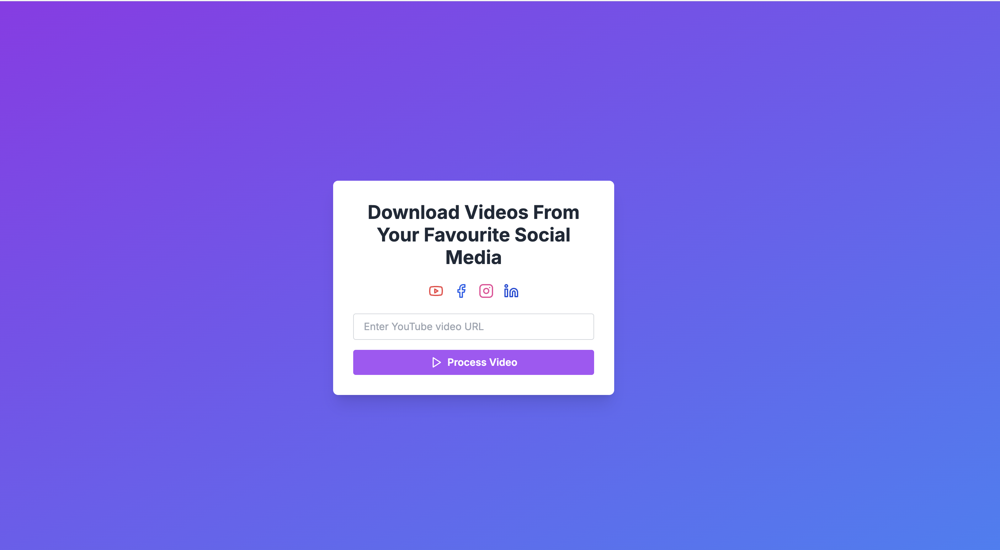

# Youtube Facebook Downloader

Welcome to the Youtube Facebook Downloader project! This project allows you to download videos from YouTube and Facebook using a simple web interface. The backend is built with Flask, and the frontend is built with Next.js 13.

## Introduction

The Youtube Facebook Downloader project is designed to provide an easy-to-use interface for downloading videos from YouTube and Facebook. The backend handles the video extraction and downloading, while the frontend provides a user-friendly interface for interacting with the backend.

## Setting Up the Backend

To set up the backend, follow these steps:

1. **Clone the repository:**
   ```bash
   git clone https://github.com/leviethung2103/youtube-facebook-downloader
   cd youtube-facebook-downloader/backend
   ```

2. **Create a virtual environment:**
   ```bash
   python3 -m venv venv
   source venv/bin/activate
   ```

3. **Install the required dependencies:**
   ```bash
   pip install -r requirements.txt
   ```

4. **Run the Flask server:**
   ```bash
   python app.py # or
   gunicorn --bind 0.0.0.0:3001 app:app
   ```

The backend server should now be running on `http://localhost:3001`.

## Setting Up the Frontend

To set up the frontend, follow these steps:

1. **Navigate to the frontend directory:**
   ```bash
   cd youtube-facebook-downloader/frontend
   ```

2. **Install the required dependencies:**
   ```bash
   npm install
   ```

3. **Run the development server:**
   ```bash
   npm run dev
   ```

The frontend should now be running on `http://localhost:3000`.

## Important Notes

- Ensure that both the backend and frontend servers are running simultaneously for the application to function correctly.
- The backend server handles video extraction and downloading, while the frontend server provides the user interface.
- You can customize the project further by modifying the backend and frontend code as needed.

## Screenshots

Screenshots of the application can be found in the `screenshots` directory.

For more information on how to use the project, refer to the documentation provided in the respective backend and frontend directories.




Happy downloading!
